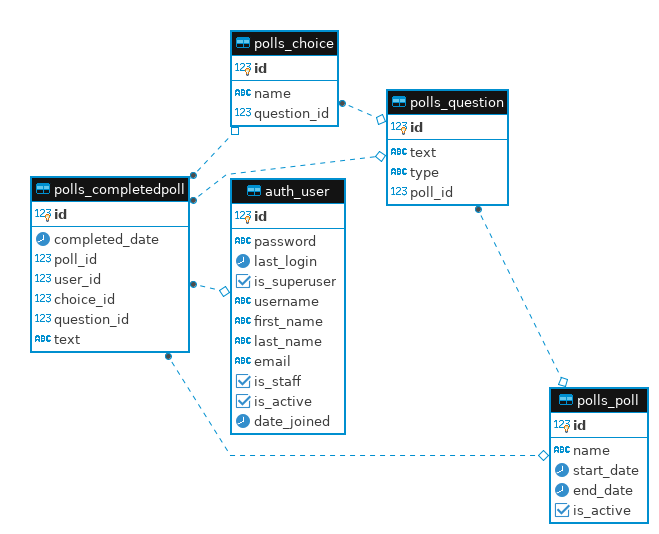

# polls
Система опроса пользователей


**Задача:** спроектировать и разработать API для системы опросов пользователей.

Функционал для администратора системы:

- авторизация в системе (регистрация не нужна)
- добавление/изменение/удаление опросов. Атрибуты опроса: название, дата старта, дата окончания, описание. После создания поле "дата старта" у опроса менять нельзя
- добавление/изменение/удаление вопросов в опросе. Атрибуты вопросов: текст вопроса, тип вопроса (ответ текстом, ответ с выбором одного варианта, ответ с выбором нескольких вариантов)

Функционал для пользователей системы:

- получение списка активных опросов
- прохождение опроса: опросы можно проходить анонимно, в качестве идентификатора пользователя в API передаётся числовой ID, по которому сохраняются ответы пользователя на вопросы; один пользователь может участвовать в любом количестве опросов
- получение пройденных пользователем опросов с детализацией по ответам (что выбрано) по ID уникальному пользователя

Использовать следующие технологии: Django 2.2.10, Django REST framework.

Результат выполнения задачи:
- исходный код приложения в github (только на github, публичный репозиторий)
- инструкция по разворачиванию приложения (в docker или локально)
- документация по API


Схема БД системы опроса пользователей:




# Документация API

**Получение списка активных опросов** 

GET метод

`active/polls/` - без параметров

Пример ответа запроса:

```
[
    {
        "id": 1,
        "name": "test poll",
        "end_date": "2020-11-19T23:00:00Z",
        "questions": [
            {
                "id": 1,
                "text": "Опиши свой город",
                "type": "text",
                "choices": []
            },
            {
                "id": 2,
                "text": "Из какого ты города?",
                "type": "sc",
                "choices": [
                    {
                        "id": 4,
                        "name": "Санкт-Петербург"
                    },
                    {
                        "id": 3,
                        "name": "Уфа"
                    },
                    {
                        "id": 2,
                        "name": "Казань"
                    },
                    {
                        "id": 1,
                        "name": "Москва"
                    }
                ]
            },
            {
                "id": 3,
                "text": "В каких городах вы были?",
                "type": "mc",
                "choices": [
                    {
                        "id": 13,
                        "name": "Самара"
                    },
                    {
                        "id": 12,
                        "name": "Сибай"
                    },
                    {
                        "id": 11,
                        "name": "Челябинск"
                    },
                    {
                        "id": 10,
                        "name": "Магнитогорск"
                    },
                    {
                        "id": 9,
                        "name": "Грозный"
                    },
                    {
                        "id": 8,
                        "name": "Казань"
                    },
                    {
                        "id": 7,
                        "name": "Санкт-Петербург"
                    },
                    {
                        "id": 6,
                        "name": "Уфа"
                    },
                    {
                        "id": 5,
                        "name": "Москва"
                    }
                ]
            }
        ]
    }
]

```


**Прохождение опроса** 

POST метод

`take/poll/` 

Пример POST запроса.
Параметры использовать в теле запроса.

Пример POST запроса: [example_post.json](example_post.json)


**Получение пройденных опросов**

GET метод

`completed/polls/{uid}/`

Параметры:

**uid**: идентификатор пользователя

Пример ответа:

```

[
    {
        "name": "test poll",
        "questions": [
            {
                "id": 1,
                "text": "Опиши свой город",
                "type": "text",
                "completed_question": [
                    {
                        "id": 63,
                        "completed_date": "2020-11-29T10:44:05.565356Z",
                        "text": "Текстовый ответ",
                        "choice": null
                    }
                ]
            },
            {
                "id": 2,
                "text": "Из какого ты города?",
                "type": "sc",
                "completed_question": [
                    {
                        "id": 64,
                        "completed_date": "2020-11-29T10:44:05.585752Z",
                        "text": null,
                        "choice": {
                            "id": 1,
                            "name": "Москва"
                        }
                    }
                ]
            },
            {
                "id": 3,
                "text": "В каких городах вы были?",
                "type": "mc",
                "completed_question": [
                    {
                        "id": 67,
                        "completed_date": "2020-11-29T10:44:05.615225Z",
                        "text": null,
                        "choice": {
                            "id": 4,
                            "name": "Санкт-Петербург"
                        }
                    },
                    {
                        "id": 66,
                        "completed_date": "2020-11-29T10:44:05.615104Z",
                        "text": null,
                        "choice": {
                            "id": 3,
                            "name": "Уфа"
                        }
                    },
                    {
                        "id": 65,
                        "completed_date": "2020-11-29T10:44:05.614943Z",
                        "text": null,
                        "choice": {
                            "id": 2,
                            "name": "Казань"
                        }
                    }
                ]
            }
        ]
    }
]

```